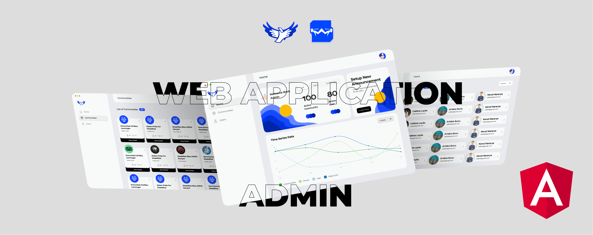
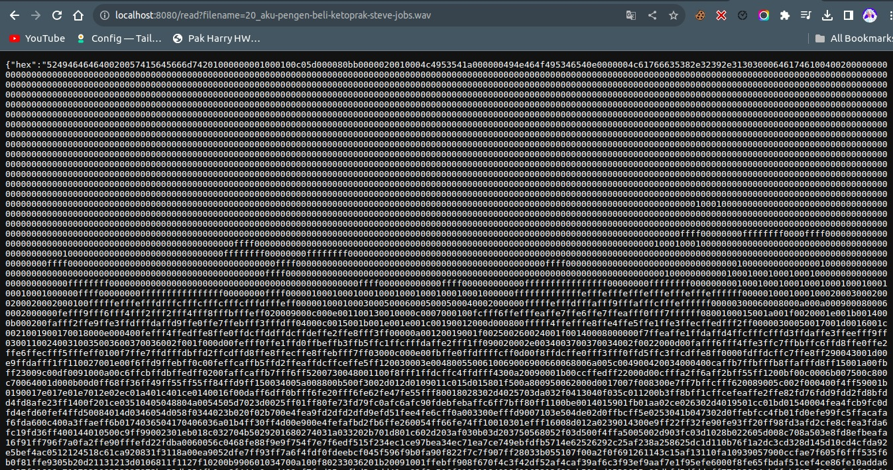

# Gesto App

  
  
  
  

## Overview

Gesto App is an innovative, multi-platform solution designed to bridge the gap between technology and accessibility. Developed for Hackfest 2023 by Google Developer Student Club Indonesia, this project leverages the power of Flutter, Arduino, and modern web technologies to deliver a seamless experience across Android, iOS, Linux, macOS, Windows, and web platforms.

## Key Feature
- <b>Cross-Platform Support: </b>Runs smoothly on various devices and operating systems.
- <b>ESP32 Integration: </b>Harnesses the power of Arduino for enhanced hardware interaction, particularly in wearable technology.
- <b>Advanced Audio Processing: </b>Utilizes sophisticated algorithms for audio analysis and manipulation.
- <b>Inclusive Design: </b>Focuses on accessibility, ensuring the app is user-friendly for all individuals.

## Getting Started

These instructions will get you a copy of the project up and running on your local machine for development and testing purposes.

## Prerequisites
- Flutter (cross-platform support)
- Golang (audio processing components)
- Angular (web application for administration)
- ESP32 / Arduino IDE (wearable system & IoT)

## Screenshots

### Mobile App

### Web App

### Wearable Device

### Web Server / API Endpoint

## Contributing

Contributions are what make the open-source community such an amazing place to learn, inspire, and create. Any contributions you make are <b>greatly appreciated.</b>

## Developed by

Ninno - ninno@hayago.id  
Kenzi - kenzi@hayago.id

